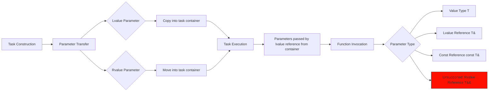

# HSLL::ThreadPool

## Overview

A lightweight C++11 thread pool implementation with **zero third-party dependencies**. Header-only integration.

Its core advantages are **efficiency and flexibility**:
*   **Avoids Dynamic Memory Allocation:** Uses stack-based pre-allocated task containers to store tasks and parameters directly on the stack.
*   **Multiple Submission Modes:** Supports blocking and non-blocking submission of single tasks or task batches.
*   **Rich Task Types:** Supports both stack-based and heap-based storage (regular tasks, asynchronous tasks, cancellable tasks).
*   **Flexible Task Management:** Allows task insertion at either the head or tail of task queues (double-ended operations).
*   **Intelligent Load Balancing:** Combines Round-Robin scheduling, queue grouping, and work-stealing mechanisms to distribute workload efficiently.
*   **Resource Optimization:** Dynamically adjusts active thread count based on current load to minimize unnecessary memory usage.
*   **Graceful Shutdown:** Provides immediate shutdown or wait-for-completion shutdown modes.

## Inclusion
```cpp
// Ensure the `basic` directory is in the same location
#include "ThreadPool.hpp"
```

## ThreadPool Class Template

### Template Parameters
```cpp
template <class TYPE = TaskStack<>>
class ThreadPool
```
- `TYPE`: Stack-based pre-allocated task container (Refer to TaskStack.md documentation)

### Initialization (Fixed Threads)
```cpp
bool init(unsigned int queueLength, unsigned int threadNum, unsigned int batchSize) noexcept
```
- **Parameters**:
  - `queueLength`: Capacity per work queue (Must be ≥ 2)
  - `threadNum`: Fixed number of worker threads (Must be ≠ 0)
  - `batchSize`: Number of tasks processed per batch (Must be ≠ 0)
- **Returns**: `true` on success, `false` on failure

### Initialization (Dynamic Threads)
```cpp
bool init(unsigned int queueLength, unsigned int minThreadNum,
          unsigned int maxThreadNum, unsigned int batchSize,
          unsigned int adjustInterval = 2500) noexcept
```
- **Parameters**:
  - `queueLength`: Capacity per work queue (Must be ≥ 2)
  - `minThreadNum`: Minimum worker threads (Must be ≠ 0 and ≤ maxThreadNum)
  - `maxThreadNum`: Maximum worker threads (Must be ≥ minThreadNum)
  - `batchSize`: Number of tasks processed per batch (Must be ≠ 0)
  - `adjustInterval`: Thread count adjustment interval (ms, Must be ≠ 0, default 2500)
- **Returns**: `true` on success, `false` on failure

### Drain Method
```cpp
void drain() noexcept
```
- **Functionality**: Waits for all submitted tasks to complete execution.
- **Important Notes**:
  1. Adding new tasks is prohibited during this call.
  2. Not a thread-safe method.
  3. Does not release resources; queues remain usable after draining.

### Shutdown Method
```cpp
void exit(bool shutdownPolicy = true)
```
- `shutdownPolicy`: 
  - `true`: Graceful shutdown (completes remaining tasks in queues)
  - `false`: Immediate shutdown

## Task Submission Interface

| Method Type          | Non-blocking      | Blocking Wait (Wait indefinitely) | Timeout Wait (for)         | Timeout Wait (until)        |
|----------------------|-------------------|-----------------------------------|----------------------------|-----------------------------|
| **Single Task Submission** | `submit`         | `wait_submit`                     | `wait_submit_for`          | `wait_submit_until`         |
| **Bulk Task Submission**   | `submit_bulk`    | `wait_submit_bulk`                | `wait_submit_bulk_for`     | `wait_submit_bulk_until`    |

## Basic Usage
```cpp
#include "ThreadPool.hpp"

using namespace HSLL;
using ContainerType = TaskStack<64, 8>; // Task container: 64-byte max size, 8-byte max alignment

void Func(int a, double b) { /*...*/ }

int main()
{
    // Create thread pool instance with ContainerType
    ThreadPool<ContainerType> pool;

    // Initialize: Queue capacity 1000, min threads 1, max threads 4, batch size 1 (default)
    pool.init(1000, 1, 4); 

    // Submit task - Basic example
    ContainerType task(Func, 42, 3.14);
    pool.submit(task);

    // In-place construction with arguments
    pool.submit(Func, 42, 3.14);

    // Destructor calls exit(false) automatically, but manual call is recommended
    pool.exit(true); // Graceful shutdown. Queue can be reinitialized via init() later

    return 0;
}
```
**See `examples` for advanced usage:** Asynchronous tasks / Cancellable tasks / Batch submissions / Smart storage / Static property checks.

## Task Lifecycle
```mermaid
graph TD
    A[Task Submission] --> B{Submission Method}
    B -->|submit/submit_bulk| C[Move task object into queue]
    C --> D[Retrieve task via move operation]
    D --> E[Execute task's execute() method]
    E --> F[Explicitly call destructor]
    F --> G[Clean up execution memory]
```

## Parameter Passing


## Important Notes
1. **Type Matching**: Submitted task types must strictly match the queue's task type.
2. **Exception Safety**:
   - Queue insertion operations **must not throw exceptions**.
   - Task (copy/move constructors) **must be noexcept**.
   - `execute()` method **must not throw**; handle all exceptions internally within tasks.
   
**Critical Consideration for Stack Tasks**: Unlike heap-allocated tasks, copying stack-based tasks can potentially throw. Since exceptions from asynchronously executed stack tasks cannot propagate to the caller, enforcing strict noexcept guarantees is a necessary compromise for stack storage.

## Platform Support
- Windows Systems
- Unix-like Systems

## Compilation Requirements
- Compiler supporting C++11 standard or newer

## Project Structure

- 📂 document--------------------Documentation
- 📂 example---------------------Usage Examples
- 📂 include---------------------Include Directory
- 📂 perf_test-------------------Performance Tests
- 📂 single_header_version-------Single-Header Version
- 📄 README.md-------------------Project Description (Chinese)
- 📄 README.en.md----------------Project Description (English)