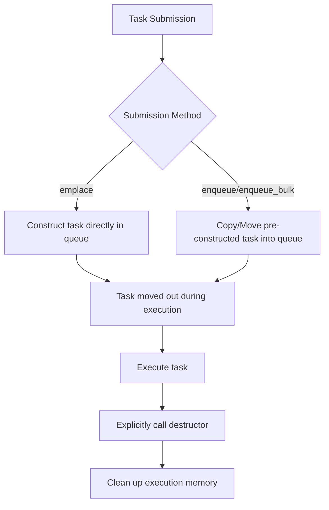
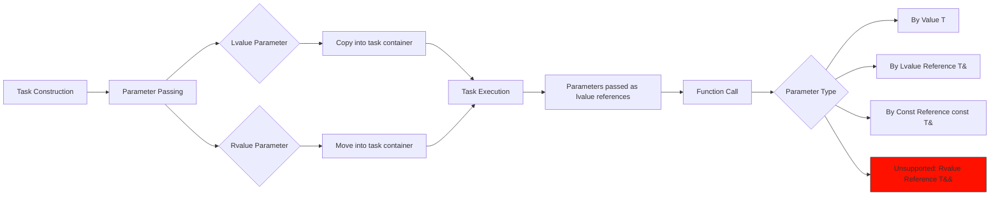

# HSLL::ThreadPool

## Overview

This is a lightweight C++11 thread pool implementation, **requiring no third-party dependencies—just include the header file to use**.

Its core strengths lie in **efficiency and flexibility**:
*   **Avoids dynamic memory allocation:** Preallocated task containers based on stack storage directly hold tasks and their parameters on the stack.
*   **Multiple submission methods:** Supports blocking or non-blocking submission of single tasks or batches to suit various scenarios.
*   **Rich Task Types:** Supports storage on the task stack or heap (regular tasks, async tasks, cancellable tasks).
*   **Flexible task management:** Allows inserting tasks at either the head or tail of the queue (double-ended operation).
*   **Intelligent Load Balancing:** Combines Round-Robin scheduling, queue grouping, and task stealing mechanisms to efficiently distribute the workload.
*   **Resource optimization:** Dynamically adjusts active thread count based on current load, reducing unnecessary memory usage.
*   **Graceful shutdown:** Offers immediate termination or waits for all pending tasks to complete before shutting down.

## Inclusion
```cpp
// Ensure the `basic` folder is in the same directory
#include "ThreadPool.hpp"
```

## ThreadPool Class Template

### Template Parameters
```cpp
template <class TYPE = TaskStack<>>
class ThreadPool
```
- `TYPE`: Preallocated stack-based task container (see TaskStack.md documentation).

### Initialization (Fixed Threads)
```cpp
bool init(unsigned int queueLength, unsigned int threadNum, unsigned int batchSize) noexcept
```
- **Parameters**:
  - `queueLength`: Capacity of each worker queue (must be ≥ 2).
  - `threadNum`: Fixed number of worker threads (must be ≠ 0).
  - `batchSize`: Number of tasks processed per batch (must be ≠ 0).
- **Return Value**: Returns `true` on successful initialization, `false` on failure.

### Initialization (Dynamic Threads)
```cpp
bool init(unsigned int queueLength, unsigned int minThreadNum,
          unsigned int maxThreadNum, unsigned int batchSize,
          unsigned int adjustInterval = 2500) noexcept
```
- **Parameters**:
  - `queueLength`: Capacity of each worker queue (must be ≥ 2).
  - `minThreadNum`: Minimum number of worker threads (must be ≠ 0 and ≤ maxThreadNum).
  - `maxThreadNum`: Maximum number of worker threads (must be ≥ minThreadNum).
  - `batchSize`: Number of tasks processed per batch (must be ≠ 0).
  - `adjustInterval`: Dynamic thread adjustment interval in milliseconds (must be ≠ 0, default 2500).
- **Return Value**: Returns `true` on successful initialization, `false` on failure.

### Drain Method
```cpp
void drain() noexcept
```
- **Functionality**: Waits for all submitted tasks to complete execution.
- **Important Notes**:
  1. Adding new tasks is prohibited during this call.
  2. Not thread-safe.
  3. Does not release resources; queues remain usable after draining.

### Shutdown Method
```cpp
void exit(bool shutdownPolicy = true)
```
- `shutdownPolicy`: 
  - `true`: Graceful shutdown (completes remaining tasks in queues).
  - `false`: Immediate shutdown (discards pending tasks).

## Task Submission Interfaces

| Method Type  | Non-Blocking | Blocking Wait | Timeout Wait  |
|--------------|--------------|---------------|---------------|
| Single Task  | emplace      | wait_emplace  | wait_emplace  |
| Prebuilt Task| enqueue      | wait_enqueue  | wait_enqueue  |
| Bulk Tasks   | enqueue_bulk | wait_enqueue_bulk | wait_enqueue_bulk |

## Basic Usage
```cpp
#include "ThreadPool.hpp"

using namespace HSLL;
using Type = TaskStack<64,8>; // Task container: max size 64 bytes, max alignment 8

void Func(int a, double b) { /*...*/ }

int main()
{
    // Create thread pool instance with task container Type
    ThreadPool<Type> pool;

    // Initialize: Queue capacity 1000, min threads 1, max threads 4, batch size 1 (default)
    pool.init(1000, 1, 4); 

    // Add task - Basic example
    Type task(Func, 42, 3.14);
    pool.enqueue(task);

    // Add task - In-place construction (avoids temporary object)
    pool.emplace(Func, 42, 3.14);

    // Add task - std::function
    std::function<void(int, int)> func(Func);
    pool.emplace(func, 42, 3.14);

    // Add task - Lambda
    pool.enqueue([](int a, int b) { /* ... */ });

    // Recommended: Manual graceful shutdown. Pool destructor calls exit(false)
    pool.exit(true); // Graceful shutdown. Can reinitialize via init() later

    return 0;
}
```
**See `examples` for more**: Asynchronous tasks / Cancellable tasks / Bulk submission / Smart storage / Static attribute checks.

## Task Lifecycle


## Parameter Passing Process


## Important Notes
1. **Type Matching**: Submitted task types must strictly match the queue's task type.
2. **Exception Safety**:
   - **Queue operations MUST NOT throw exceptions**.
   - For `emplace`: Task construction (parameters/copy/move) MUST NOT throw.
   - For `enqueue`/`enqueue_bulk`: Task copy/move construction MUST NOT throw.
   - `execute()` MUST NOT throw. Handle all potential exceptions within the task itself.

**Unlike heap-allocated tasks, copying stack-based tasks can fail. Asynchronous execution prevents propagating exceptions to the caller. Strict exception guarantees are a necessary compromise for stack-stored tasks.**

## Platform Support
- Linux (aligned_alloc)
- Windows (_aligned_malloc)
- C++11 or newer

## Project Structure

- 📂 document--------------------Documentation
- 📂 example---------------------Usage Examples
- 📂 include---------------------Include Directory
- 📂 perf_test-------------------Performance Tests
- 📂 single_header_version-------Single-Header Version
- 📄 README.md-------------------Project Documentation (中文)
- 📄 README.en.md----------------Project Documentation (English)