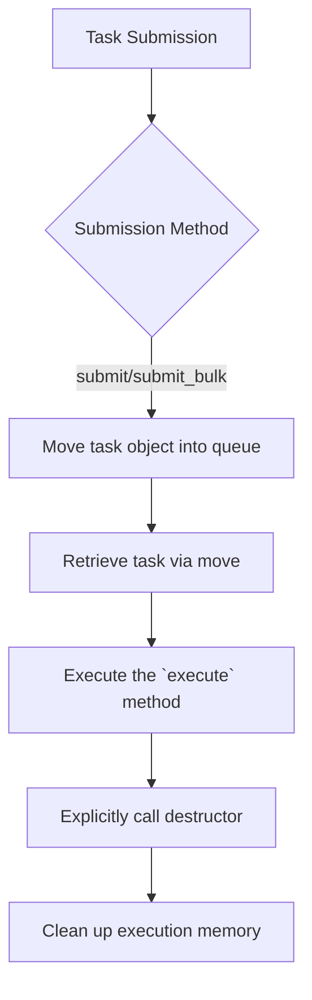
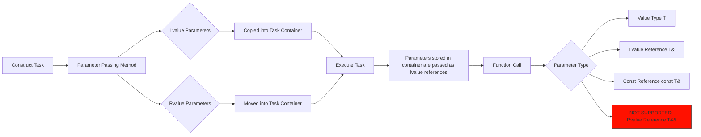

# HSLL::ThreadPool

## Overview

A header-only C++11 lightweight thread pool with no third-party dependencies. Using stack pre-allocation to avoid dynamic memory allocation, supports double-ended task insertion and multiple submission methods, and implements intelligent load balancing through mechanisms like work-stealing.

## Inclusion
```cpp
// Ensure the `basic` folder is in the same directory as this file.
#include "ThreadPool.hpp"
```

## ThreadPool Class Template

### Template Parameters
```cpp
template <class TYPE = TaskStack<>>
class ThreadPool
```
- `TYPE`: A stack-based pre-allocated task container (see the TaskStack.md documentation for details).

### Initialization Method
```cpp
bool init(unsigned int queueLength, unsigned int threadNum, unsigned int batchSize) noexcept
```
- **Parameters**:
  - `queueLength`: Capacity of each worker queue (must be ≥ 2).
  - `threadNum`: Fixed number of worker threads (must be ≠ 0).
  - `batchSize`: Number of tasks processed in a single batch (must be ≠ 0).
- **Return Value**: Returns `true` if initialization succeeds, `false` otherwise.

### Drain Method
```cpp
void drain() noexcept
```
- **Function**: Waits for all currently submitted tasks to finish execution.
- **Important Notes**:
  1. Do **not** add new tasks while this method is executing.
  2. This is a non-thread-safe method.
  3. Does not release resources after execution; the queues can continue to be used.

### Shutdown Method
```cpp
void shutdown(bool graceful = true) noexcept
```
- `graceful`:
  - `true`: Graceful shutdown (executes remaining tasks in the queues).
  - `false`: Immediate shutdown.

## Task Submission Interfaces

| Method Type      | Non-blocking     | Blocking Wait (Indefinite) | Timeout Wait (for)         | Timeout Wait (until)        |
|------------------|------------------|----------------------------|----------------------------|-----------------------------|
| **Single Task**  | `submit`         | `wait_submit`              | `wait_submit_for`          | `wait_submit_until`         |
| **Bulk Tasks**   | `submit_bulk`    | `wait_submit_bulk`         | `wait_submit_bulk_for`     | `wait_submit_bulk_until`    |

## Basic Usage
```cpp
#include "ThreadPool.hpp"

using namespace HSLL;
using ContainerType = TaskStack<64, 8>; // Task container with max capacity of 64 bytes and max alignment of 8.

void Func(int a, double b) { /*...*/ }

int main()
{
    // Create a thread pool instance using ContainerType for task storage.
    ThreadPool<ContainerType> pool;

    // Initialize the thread pool: queue capacity 1000, 4 threads, batch size 1 (default).
    pool.init(1000, 4);

    // Add a task - basic example.
    ContainerType task(Func, 42, 3.14);
    pool.submit(task);

    // Can also directly pass arguments for in-place construction.
    pool.submit(Func, 42, 3.14);

    // The destructor automatically calls exit(false), but manual call is recommended to control exit behavior.
    pool.shutdown(true); // Graceful shutdown. The queue can be re-initialized via `init` afterwards.

    return 0;
}
```
**For more usage examples, please refer to the `example` folder:** Asynchronous tasks / Cancelable tasks / Bulk tasks / Smart storage / Static property checks.

## Task Lifecycle


## Parameter Passing Process


## Important Notes
1. **Type Matching**: The type of submitted tasks must strictly match the queue's task type.
2. **Exception Safety**:
   - No queueing operation is allowed to throw exceptions.
   - Ensure that task (copy/move construction) does not throw exceptions.
   - The `execute()` method must not throw exceptions. All potential exceptions must be caught and handled within the task itself.

   **Unlike heap-allocated tasks, copying stack-allocated tasks can potentially throw exceptions. Since exceptions from asynchronously executed stack tasks cannot be propagated to the caller, strict exception guarantees are a necessary compromise for storing tasks on the stack.**

## Platform Support
- Windows
- Unix-like Systems

## Compilation Requirements
- A compiler supporting the C++11 standard or newer.

## Project Structure
-  document--------------------Component documentation
-  example---------------------Usage examples
-  include---------------------Include directory
-  perf_test-------------------Performance tests
-  single_header_version-------Single-header version
-  README.md-------------------Chinese project description (README)
-  README.en.md----------------English project description (README)