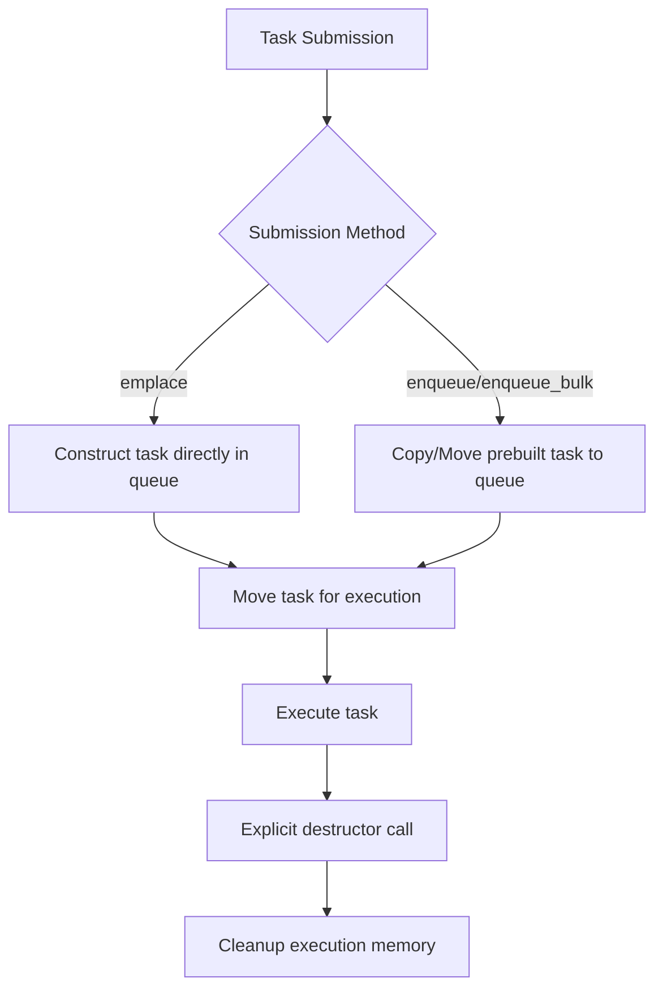
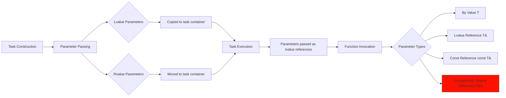

# HSLL::ThreadPool

## Overview  

This is a lightweight C++11 thread pool implementation that **requires no third-party dependencies and can be used with just a header file**.  

Its core strengths lie in **efficiency and flexibility**:  
*   **Avoids dynamic memory allocation:** Utilizes a stack-based pre-allocated task container to store tasks and their parameters directly on the stack.  
*   **Multiple submission methods:** Supports submitting single or batch tasks either blocking or non-blocking, catering to diverse scenarios.  
*   **Flexible task management:** Allows inserting tasks at either the head or tail of the task queue (dual-end insertion).  
*   **Intelligent load balancing:** Combines Round-Robin scheduling, secondary queue selection, and task stealing mechanisms to effectively distribute workload.  
*   **Resource optimization:** Dynamically adjusts the number of active threads based on current load, minimizing unnecessary memory footprint.  
*   **Graceful shutdown:** Offers both immediate shutdown and shutdown-after-all-tasks-complete modes.

## Inclusion
```cpp
// Ensure the basic folder is in the same directory
#include "ThreadPool.hpp"
```

## ThreadPool Class Template

### Template Parameters
```cpp
template <class TYPE = TaskStack<>>
class ThreadPool
```
- `TYPE`: Stack-based preallocated task container (see TaskStack.md)


### Initialization Method
```cpp
bool init(unsigned int queueLength, unsigned int minThreadNum,
            unsigned int maxThreadNum, unsigned int batchSize = 1,
            std::chrono::milliseconds adjustInterval = std::chrono::milliseconds(3000))
```
- **Parameters**:  
  - `queueLength`: Capacity of each work queue  
  - `minThreadNum`: Minimum number of worker threads  
  - `maxThreadNum`: Maximum number of worker threads  
  - `batchSize`: Number of tasks processed per batch (default: `1`)  
  - `adjustInterval`: Interval for dynamically adjusting active thread count (default: `3000 milliseconds`)  
- **Return Value**: Returns `true` if initialization succeeds  
- **Functionality**: Allocates resources and starts worker threads (initialized to `maxThreadNum` value)  

### Shutdown Method
```cpp
void exit(bool shutdownPolicy = true)
```
- `shutdownPolicy`: 
  - `true`: Graceful shutdown (complete remaining tasks)
  - `false`: Immediate shutdown

## Task Submission Interfaces

| Method Type      | Non-Blocking | Blocking Wait | Timeout Wait  |
|------------------|--------------|---------------|---------------|
| Single Task      | emplace      | wait_emplace  | wait_emplace  |
| Prebuilt Task    | enqueue      | wait_enqueue  | wait_enqueue  |
| Bulk Tasks       | enqueue_bulk | wait_enqueue_bulk | wait_enqueue_bulk |

## Basic Usage
```cpp
#include "ThreadPool.hpp"

using namespace HSLL;
using Type = TaskStack<64,8>; // Task container: 64-byte capacity, 8-byte alignment

void Func(int a, double b) { /*...*/ }

int main()
{
    // Create thread pool instance with Type container
    ThreadPool<Type> pool;

    // Initialize: queue capacity=1000, min threads=1, max threads=4, batch size=1 (default)
    pool.init(1000, 1, 4); 

    // Submit task - basic example
    Type task(Func, 42, 3.14);
    pool.enqueue(task);

    // Submit task - in-place construction
    pool.emplace(Func, 42, 3.14); // Avoids temporary object construction

    // Submit task - std::function
    std::function<void(int, double)> func = Func;
    pool.emplace(func, 42, 3.14);

    // Submit task - lambda
    pool.enqueue([](int a, double b){ /*...*/ });

    // Recommended to manually control shutdown behavior
    pool.exit(true); // Graceful shutdown. Can reinitialize with init() later

    return 0;
}
```
**See `example` folder for advanced usage**

## Task Lifecycle


## Parameter Passing


## Important Notes
1. **Type Matching**: Submitted task types must exactly match queue task type
2. **Alignment Requirements**: Task alignment must be ≤ container's alignment
3. **Exception Safety**:
   - Queue operations must not throw exceptions
   - `emplace()` requires noexcept parameter/copy/move construction
   - `execute()` must handle all exceptions internally (no exception propagation)
   
**Unlike heap-allocated tasks, stack task copying can throw exceptions. Strict exception guarantees are necessary compromises for stack-based storage since asynchronous tasks cannot propagate exceptions to callers.**

## Platform Support
- Linux (aligned_alloc)
- Windows (_aligned_malloc)
- C++11 or newer

## Project Structure

- 📂 document--------------------Component Documentation
- 📂 example---------------------Usage Examples
- 📂 include---------------------Include Directory
- 📂 perf_test-------------------Performance Tests
- 📂 single_header_version-------Single-Header Version
- 📄 README.md-------------------Project Documentation (Chinese)
- 📄 README.en.md----------------Project Documentation (English)