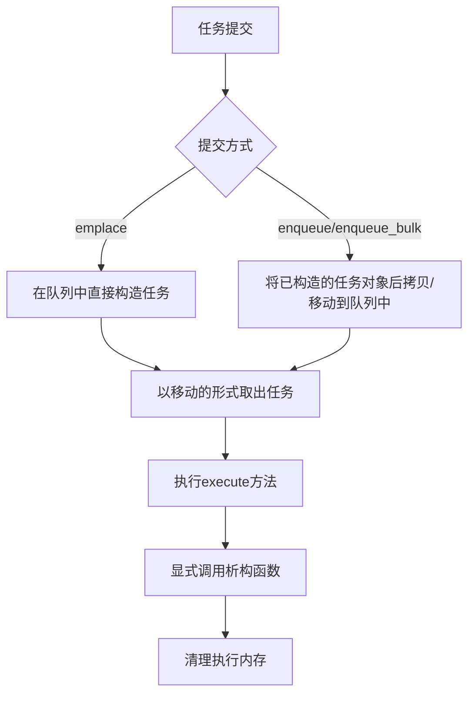
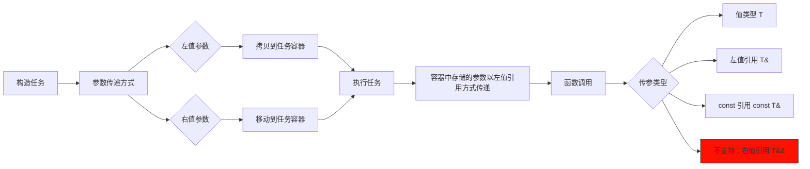

# HSLL::ThreadPool

## 概述

这是一个轻量级的 C++11 线程池实现，**无第三方依赖，仅需头文件即可使用**。

它的核心优势在于**高效和灵活**：
*   **避免动态内存分配：** 通过基于栈的预分配任务容器，将任务及其参数直接存储在栈上。
*   **多种提交方式：** 支持阻塞或非阻塞地提交单个任务或批量任务，满足不同场景需求。
*   **丰富任务类型：** 支持任务栈或堆上存储(普通任务，异步任务，可取消任务)。
*   **灵活的任务管理：** 允许从任务队列的头部或尾部插入任务（双端操作）。
*   **智能负载均衡：** 结合 Round-Robin 调度、二级队列选取和任务窃取机制，有效分散工作负载。
*   **资源优化：** 能够根据当前负载动态调整活跃线程数量，减少不必要的内存占用。
*   **优雅关闭：** 提供立即关闭或等待所有任务执行完毕后再关闭两种模式。

## 引入
```cpp
//确保basic文件夹在其的同级目录
#include "ThreadPool.hpp"
```

## ThreadPool 类模板

### 模板参数
```cpp
template <class TYPE = TaskStack<>>
class ThreadPool
```
- `TYPE`: 基于栈的预分配任务容器（详见TaskStack.md文档）


### 初始化方法（固定线程）
```cpp
bool init(unsigned int queueLength, unsigned int threadNum, unsigned int batchSize) noexcept
```
- **参数**：
  - `queueLength`：每个工作队列的容量（必须 ≥ 2）
  - `threadNum`：固定的工作线程数量（必须 ≠ 0）
  - `batchSize`：单次处理任务数（必须 ≠ 0）
- **返回值**：初始化成功返回 `true`，失败返回 `false`

### 初始化方法（动态线程）
```cpp
bool init(unsigned int queueLength, unsigned int minThreadNum,
          unsigned int maxThreadNum, unsigned int batchSize,
          unsigned int adjustInterval = 2500) noexcept
```
- **参数**：
  - `queueLength`：每个工作队列的容量（必须 ≥ 2）
  - `minThreadNum`：工作线程最小数量（必须 ≠ 0 且 ≤ maxThreadNum）
  - `maxThreadNum`：工作线程最大数量（必须 ≥ minThreadNum）
  - `batchSize`：单次处理任务数（必须 ≠ 0）
  - `adjustInterval`：线程数动态调整间隔（毫秒，必须 ≠ 0，默认 2500）
- **返回值**：初始化成功返回 `true`，失败返回 `false`

### 排空方法
```cpp
void drain() noexcept
```
- **功能**：等待所有任务执行完成
- **注意事项**：
  1. 调用期间禁止添加新任务
  2. 非线程安全方法
  3. 调用后不释放资源，队列可继续使用

### 关闭方法
```cpp
void exit(bool shutdownPolicy = true)
```
- `shutdownPolicy`: 
  - true: 优雅关闭（执行完队列剩余任务）
  - false: 立即关闭

## 任务提交接口

| 方法类型      | 非阻塞      | 阻塞等待    | 超时等待      |
|-------------|------------|------------|--------------|
| 单任务提交    | emplace    | wait_emplace| wait_emplace |
| 预构建任务   | enqueue     | wait_enqueue| wait_enqueue  |
| 批量任务     | enqueue_bulk| wait_enqueue_bulk | wait_enqueue_bulk |


## 基本使用
```cpp

#include "ThreadPool.hpp"

using namespace HSLL;
using Type = TaskStack<64,8>;//最大容量为64字节,最大对齐值为8的任务容器

void Func(int a, double b) { /*...*/ }

int main()
{
    //创建线程池实例,任务容器使用Type类型
    ThreadPool<Type> pool;

    // 初始化线程池: 队列容量1000，最小活跃线程数1，最大线程数4，批处理大小为1（default）
    pool.init(1000,1,4); 

    //添加任务_基本示例
    Type task(Func, 42, 3.14);
    pool.enqueue(task);

    //添加任务_就地构造
    pool.emplace(Func, 42, 3.14);//相比于enqueue减少了一次临时对象的构造

    //添加任务_std::function
    std::function<void(int,int)> func(Func);
    pool.emplace(func,42,3.14);

    //添加任务_lambda
    pool.enqueue([](int a,int b){});

    //线程池析构时自动调用exit(false), 但仍然建议手动调用以控制退出行为
    pool.exit(true); // 优雅关闭。调用后可通过init重新初始化队列

    return 0;
}
```
**更多用法请参考example**：异步任务/可取消任务/批量任务/智能存储/属性静态检查

## 任务生命周期


## 参数传递过程


## 注意事项
1. **类型匹配**：提交任务类型必须严格匹配队列任务类型
2. **异常安全**：
   - 任何入队列行为不允许抛出异常
   - 调用emplace系列接口需要保证任务（参数/拷贝/移动构造）不抛出异常，其它类型接口需要保证任务(拷贝/移动构造)不抛出异常
   - execute()方法不允许抛出异常，需要在任务内部捕获并处理所有可能的异常
     
**不同于申请在堆上的任务，栈上任务的拷贝可能发生异常。由于异步执行的栈上任务无法
将异常传播到调用者，因此严格的异常保证是出于将任务存储在栈上的必要妥协**

## 平台支持
- Linux (aligned_alloc)
- Windows (aligned_malloc)
- C++11 或更新标准

## 项目结构

- 📂 document--------------------组件文档
- 📂 example---------------------使用示例
- 📂 include---------------------包含目录
- 📂 perf_test-------------------性能测试
- 📂 single_header_version-------单头文件版本
- 📄 README.md-------------------中文项目说明
- 📄 README.en.md----------------英文项目说明