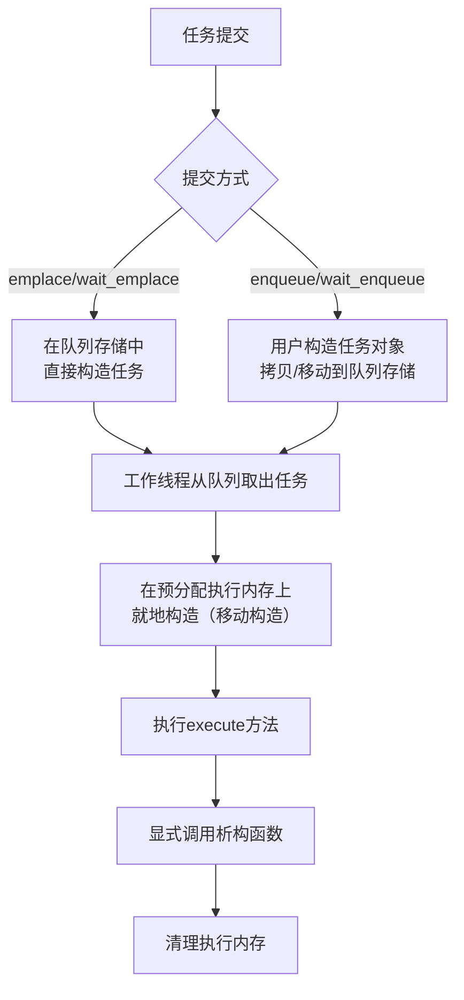

# HSLL::ThreadPool

## 概述
HSLL::ThreadPool 是一个轻量级C++11线程池实现，具有以下特性：

1. **多队列架构** - 每个工作线程拥有独立的任务队列，减少锁争用
2. **负载均衡** - 采用round-robin+二级队列选取机制+任务窃取机制实现负载均衡
3. **定长任务容器** - 基于栈的预分配任务容器，将所有参数储存在栈上，避免动态申请空间
4. **多提交接口** - 提供阻塞/非阻塞、单任务/批量任务等多种接口
5. **双端插入支持** - 支持从队列头/尾插入以适应不同任务优先级
6. **优雅关闭** - 支持立即关闭和等待任务完成的优雅关闭模式

## 引入
```cpp
//依赖于（TPBlockQueue.hpp，TPTask.hpp，TPRWLock.hpp TPSemaphore.hpp），请确保它们处于ThreadPool.hpp同级目录
#include "ThreadPool.hpp"
```

## 核心组件

### ThreadPool 类模板

#### 模板参数
```cpp
template <class TYPE = TaskStack<>>
class ThreadPool
```
- `TYPE`: 基于栈的预分配任务容器

#### 初始化方法
```cpp
bool init(unsigned int queueLength, unsigned int minThreadNum,
            unsigned int maxThreadNum, unsigned int batchSize = 1)
```
- **参数**：
  - `queueLength`: 每个工作队列的容量
  - `minThreadNum`: 工作线程最小数量
  - `maxThreadNum`:工作线程最大数量
  - `batchSize`: 单次处理任务数
- **返回值**：初始化成功返回true
- **功能**：分配资源并启动工作线程(初始值为最大数量)

#### 任务提交接口

```cpp

enum INSERT_POS
{
    TAIL, //插入到队列尾部 
    HEAD  //插入到队列头部
};
```

1. **单任务提交(就地构造)**
```cpp
template <INSERT_POS POS = TAIL, typename... Args>
bool emplace(Args &&...args)

template <INSERT_POS POS = TAIL, typename... Args>
bool wait_emplace(Args &&...args)

template <INSERT_POS POS = TAIL, class Rep, class Period, typename... Args>
bool wait_emplace(const std::chrono::duration<Rep, Period> &timeout, Args &&...args)
```

2. **单任务提交**
```cpp
template <INSERT_POS POS = TAIL, class U>
bool enqueue(U &&task)

template <INSERT_POS POS = TAIL, class U>
bool wait_enqueue(U &&task)

template <INSERT_POS POS = TAIL, class U, class Rep, class Period>
bool wait_enqueue(U &&task, const std::chrono::duration<Rep, Period> &timeout)
```

3. **批量提交**
```cpp
template <BULK_CMETHOD METHOD = COPY, INSERT_POS POS = TAIL>
unsigned int enqueue_bulk(T *tasks, unsigned int count)

template <BULK_CMETHOD METHOD = COPY, INSERT_POS POS = TAIL>
unsigned int wait_enqueue_bulk(T *tasks, unsigned int count)

template <BULK_CMETHOD METHOD = COPY, INSERT_POS POS = TAIL, class Rep, class Period>
unsigned int wait_enqueue_bulk(T *tasks, unsigned int count, const std::chrono::duration<Rep, Period> &timeout)
```
```cpp
enum BULK_CMETHOD
{
  COPY, // 使用拷贝语义，将任务拷贝到队列。原任务数组依旧有效
  MOVE  // 使用移动语义，将任务移动到队列
};
```
#### 关闭方法
```cpp
void exit(bool shutdownPolicy = true)
```
- `shutdownPolicy`: 
  - true: 优雅关闭（执行完队列剩余任务）
  - false: 立即关闭

#### 工作机制
- **任务分发**：采用轮询+跳半队列负载均衡策略
- **工作线程**：每个线程优先处理自己的队列，空闲时支持任务窃取

### 基本使用
```cpp
HSLL::ThreadPool<> pool;
pool.init(1000, 4); // 4线程，每队列容量1000

// 提交lambda任务
pool.emplace([]{
    std::cout << "Task executed!\n";
});

// 提交带参数的函数
void taskFunc(int a, double b) { /*...*/ }

//添加任务示例
pool.enqueue(taskFunc, 42, 3.14);

//异步示例
std::promise<int> resultPromise;
auto resultFuture = resultPromise.get_future();
pool.emplace([&resultPromise] {
      int sum = 0;
      for (int i = 1; i <= 100; i++) {
        sum += i;
   }
  resultPromise.set_value(sum); 
});
int total = resultFuture.get();

//线程池析构时自动调用exit(false), 但仍然建议手动调用以控制退出行为
pool.exit(true); // 优雅关闭
```

### 任务生命周期


## 注意事项
1. **类型匹配**：提交任务类型必须严格匹配队列任务类型
2. **对齐要求**：任务最大对齐值必须小于等于队列任务类型的对齐值
3. **异常安全**：
   - 任何入队列行为不允许抛出异常
   - 调用emplace类接口需要保证任务（参数/拷贝/移动构造）不抛出异常，其它类型接口需要保证任务(拷贝/移动构造)不抛出异常
   - execute()方法不允许抛出异常，需要在任务内部捕获并处理所有可能的异常

4. **参数传递**：
   - 大型对象应使用指针或移动语义传递
   - 避免在任务中捕获可能失效的引用
5. **结果获取**：
   - 使用std::promise/std::future获取异步结果
   - promise必须在任务执行期间保持有效


## 接口对比表

| 方法类型      | 非阻塞      | 阻塞等待    | 超时等待      |
|-------------|------------|------------|--------------|
| 单任务提交    | emplace    | wait_emplace| wait_emplace |
| 预构建任务   | enqueue     | wait_enqueue| wait_enqueue  |
| 批量任务     | enqueue_bulk| wait_enqueue_bulk | wait_enqueue_bulk |

## 平台支持
- Linux (aligned_alloc)
- Windows (aligned_malloc)
- C++11 或更新标准

## 其它
- **组件文档**: `document`文件夹
- **性能测试**: `performance test`文件夹
