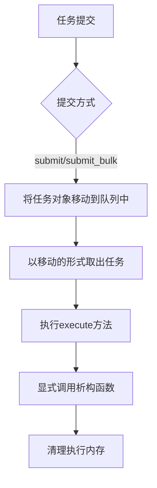
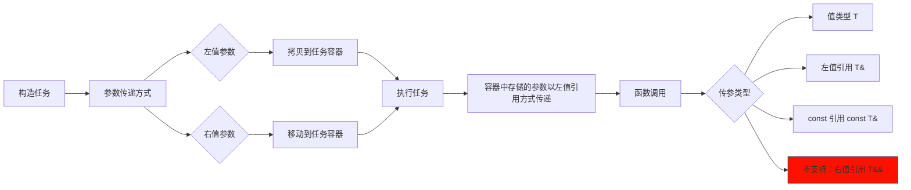

# HSLL::ThreadPool

## 概述

一个仅需头文件的C++11轻量级线程池，无第三方依赖。通过栈预分配避免动态内存分配，支持任务的双端插入与多种提交方式，并采用任务窃取等机制实现智能负载均衡。

## 引入
```cpp
//确保basic文件夹在其的同级目录
#include "ThreadPool.hpp"
```

## ThreadPool 类模板

### 模板参数
```cpp
template <class TYPE = TaskStack<>>
class ThreadPool
```
- `TYPE`: 基于栈的预分配任务容器（详见TaskStack.md文档）


### 初始化方法
```cpp
bool init(unsigned int queueLength, unsigned int threadNum, unsigned int batchSize) noexcept
```
- **参数**：
  - `queueLength`：每个工作队列的容量（必须 ≥ 2）
  - `threadNum`：固定的工作线程数量（必须 ≠ 0）
  - `batchSize`：单次处理任务数（必须 ≠ 0）
- **返回值**：初始化成功返回 `true`，失败返回 `false`

### 排空方法
```cpp
void drain() noexcept
```
- **功能**：等待所有任务执行完成
- **注意事项**：
  1. 调用期间禁止添加新任务
  2. 非线程安全方法
  3. 调用后不释放资源，队列可继续使用

### 关闭方法
```cpp
void shutdown(bool graceful = true) noexcept
```
- `graceful`: 
  - true: 优雅关闭（执行完队列剩余任务）
  - false: 立即关闭

## 任务提交接口

| 方法类型       | 非阻塞           | 阻塞等待（无限等待） | 超时等待（for）            | 超时等待（until）           |
|---------------|------------------|----------------------|--------------------------|---------------------------|
| **单任务提交** | `submit`        | `wait_submit`       | `wait_submit_for`        | `wait_submit_until`       |
| **批量任务提交** | `submit_bulk`   | `wait_submit_bulk`  | `wait_submit_bulk_for`   | `wait_submit_bulk_until`  |


## 基本使用
```cpp

#include "ThreadPool.hpp"

using namespace HSLL;
using ContainerType = TaskStack<64,8>;//最大容量为64字节,最大对齐值为8的任务容器

void Func(int a, double b) { /*...*/ }

int main()
{
    //创建线程池实例,任务容器使用Type类型
    ThreadPool<ContainerType> pool;

    // 初始化线程池: 队列容量1000，线程数4，批处理大小为1（default）
    pool.init(1000,4); 

    //添加任务_基本示例
    ContainerType task(Func, 42, 3.14);
    pool.submit(task);

    //也可以直接传入参数进行就地构造
    pool.submit(Func, 42, 3.14);

    //线程池析构时自动调用exit(false), 但仍然建议手动调用以控制退出行为
    pool.shutdown(true); // 优雅关闭。调用后可通过init重新初始化队列

    return 0;
}
```
**更多用法请参考example**：异步任务/可取消任务/批量任务/智能存储/属性静态检查

## 任务生命周期


## 参数传递过程


## 注意事项
1. **类型匹配**：提交任务类型必须严格匹配队列任务类型
2. **异常安全**：
   - 任何入队列行为不允许抛出异常
   - 需要保证任务(拷贝/移动构造)不抛出异常
   - execute()方法不允许抛出异常，需要在任务内部捕获并处理所有可能的异常
     
**不同于申请在堆上的任务，栈上任务的拷贝可能发生异常。由于异步执行的栈上任务无法
将异常传播到调用者，严格的异常保证是出于将任务存储在栈上的必要妥协**

## 平台支持
- Windows 系统
- 类 Unix 系统

## 编译要求
- 需支持 C++11 或更新标准的编译器

## 项目结构
-  document--------------------组件文档
-  example---------------------使用示例
-  include---------------------包含目录
-  perf_test-------------------性能测试
-  single_header_version-------单头文件版本
-  README.md-------------------中文项目说明
-  README.en.md----------------英文项目说明