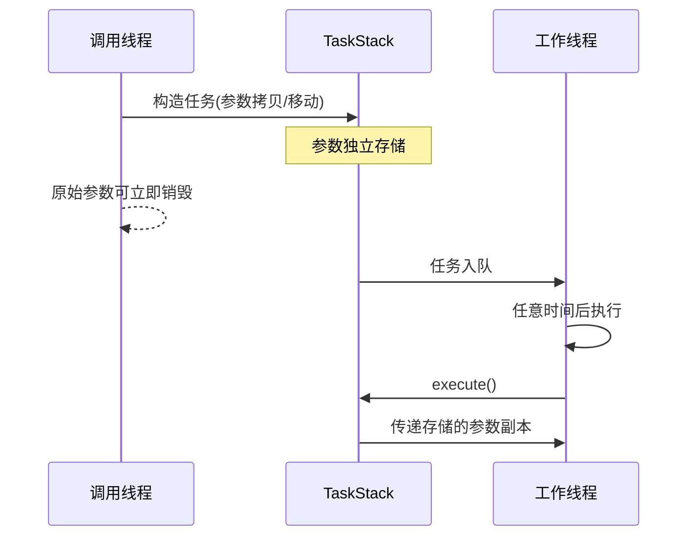

# TaskStack - 栈分配任务容器

## 概述
TaskStack 是一个基于栈内存的任务容器模板类，通过小缓冲区优化(SBO)实现无堆内存分配的任务存储，支持存储任意可调用对象及其参数.

## 核心特性

- **零堆分配**：使用固定大小栈存储，避免动态内存分配
- **类型擦除**：可存储函数指针、lambda、函数对象等任意可调用类型
- **参数绑定**：支持绑定任意数量/类型的参数
- **值语义**：支持拷贝/移动构造和赋值操作
- **编译期检查**：静态断言确保存储空间充足

---

## 使用示例

### 基本用法
```cpp
void print_sum(int a, int b) {
    std::cout << a + b << std::endl;
}

TaskStack<> task1(print_sum, 3, 5); // 默认64字节存储
task1.execute(); // 输出8
```

### Lambda表达式
```cpp
std::string prefix = "Result:";
TaskStack<128> task2(
    [](const std::string& s, int x) {
        std::cout << s << x << std::endl;
    },
    prefix, 42
);
task2.execute(); // 输出Result:42
```

### 避免参数拷贝
```cpp
std::vector<int> big_data(1000);

// 通过lambda捕获引用(不存储参数副本)
TaskStack<> task3([&]{
    process_data(big_data); 
});
```

---

## 参数传递机制

### 存储阶段
- 参数按**完美转发**存储：保留原始值/右值语义对储存副本进行构造
- 参数类型会经过`std::decay`处理
- **示例**：
  ```cpp
  std::string s = "hello";
  TaskStack<> task([](std::string& ), std::move(s)); // 移动构造存储
  ```

### 执行阶段
- **始终传递左值**：调用时参数以左值形式传递
- **重要限制**：
  - 不支持接收右值引用的函数参数
  ```cpp
  // 错误示例：
  TaskStack<> task([](std::string&& s){...}, "tmp"); 
  ```

### 高效使用建议
1. 对需要移动语义的参数：
   ```cpp
   void process(std::string& s) {
       auto s2 = std::move(s);//该操作是安全的
   }
   ```
2. 对长期有效的大对象：通过lambda捕获引用

### 详细流程


---

## 存储管理

### 容量控制
- 默认存储大小64字节，可通过模板参数调整：
  ```cpp
  TaskStack<256> large_task(...);
  ```
- 编译期检查存储容量：
  ```cpp
  static_assert(sizeof(stack_task_t<F, Args...>) <= TSIZE);
  ```

### 容量查询
```cpp

// 获取任务类型大小
unsigned int needed_size = stack_tsize_v<F, Args...>

// 编译期获取任务类型大小
constexpr unsigned int needed_size = sizeof(stack_task_t<F, Args...>)；

```

---

## 注意事项

1. **右值参数限制**：任务函数签名禁止包含右值引用参数
2. **对象生命周期**：
   - 按值存储的参数需保证在任务执行前有效
   - 推荐对长期对象使用引用捕获
3. **存储溢出**：
   - 超出预设大小会导致编译错误
   - 可通过`stack_tsize_v`预计算所需大小
4. **移动语义**：
   - 移动构造后源对象失效
   - 任务对象本身支持移动语义