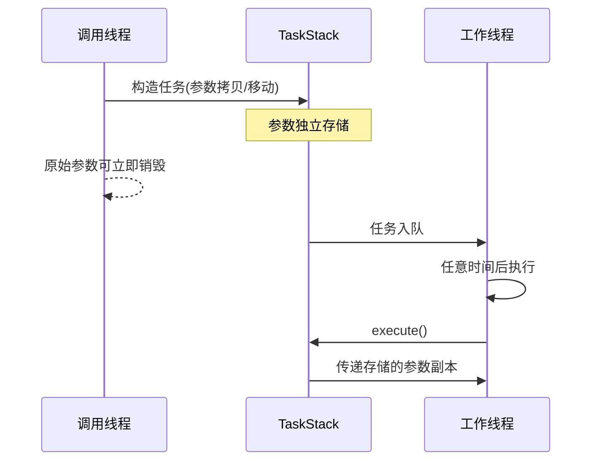

# TaskStack - 栈分配任务容器

## 概述
TaskStack 是一个基于栈内存的任务容器模板类，通过小缓冲区优化(SBO)实现无堆内存分配的任务存储

## 核心特性

- **零堆分配**：使用固定大小栈存储，避免动态内存分配
- **类型擦除**：可存储函数指针、lambda、函数对象等任意可调用类型
- **参数绑定**：支持绑定任意数量/类型的参数
- **语义支持**：支持拷贝/移动构造和赋值操作
- **编译期检查**：静态断言确保存储空间充足

---

## 使用示例

### 基本用法
```cpp
void print_sum(int a, int b) {
    std::cout << a + b << std::endl;
}

TaskStack<> task1(print_sum, 3, 5); 
task1.execute(); // 输出8
```

### Lambda表达式
```cpp
std::string prefix = "Result:";
TaskStack<128> task2(
    [](const std::string& s, int x) {
        std::cout << s << x << std::endl;
    },
    prefix, 42
);
task2.execute(); // 输出Result:42
```

### 避免参数拷贝
```cpp
std::vector<int> big_data(1000);

// 1.通过lambda捕获引用(不存储参数副本)
TaskStack<> task3([&]{
    process_data(big_data); 
});


// 2.通过指针传递
TaskStack<> task3([](std::vector<int>* big_data){
    process_data(big_data); 
},&big_data);

```

---

## 参数传递机制

### 存储阶段
- 参数按**完美转发**存储：保留原始值/右值语义对储存副本进行构造
- 参数类型会经过`std::decay`处理
- **示例**：
  ```cpp
  std::string s = "hello";
  TaskStack<> task([](std::string& s){...}, std::move(s)); // 移动构造存储
  ```

### 执行阶段
- **始终传递左值**：调用时参数以左值形式传递
- **限制**：
  - 不支持接收右值引用的函数参数
  ```cpp
  // 错误示例：
  TaskStack<> task([](std::string&& s){...}, "tmp"); 
  ```

### 高效使用建议
1. 对需要移动语义的参数：
   ```cpp
   void process(std::string& s) {
       auto s2 = std::move(s); // 安全操作：s是存储在任务内的副本
   }
   ```
2. 对长期有效的大对象：通过lambda捕获引用

### 详细流程


---

## 存储管理 (更新)

### 容量控制
- 默认存储大小64字节，可通过模板参数调整：
  ```cpp
  TaskStack<256> large_task(...);//256字节
  ```

### 对齐控制
- 默认8字节对齐，可通过模板参数调整：
  ```cpp
  TaskStack<64,16> task;//64字节存储，16字节对齐
  ```

### 编译期查询

```cpp
// 编译期获取任务所需大小
constexpr unsigned int needed_size_c11 = task_stack<F, Args...>::size;
constexpr unsigned int needed_size_c14 = task_stack_V<F, Args...>;

// 编译期获取任务是否能被TaskStack存储
using type = TaskStack<?,?>;
constexpr bool isInvalid_c11= type::task_invalid<F, Args...>::value;
constexpr bool isInvalid_c14= type::task_invalid_v<F, Args...>;


```

## 注意事项

1. **右值参数限制**：任务函数签名禁止包含右值引用参数
2. **对象生命周期**：
   - 引用捕获/指针传递的参数需保证在任务执行前有效
   - 推荐对长期对象使用引用捕获/指针转递
3. **存储溢出**：
   - 任务超出可用大小会导致编译错误
4. **移动语义**：
   - 移动构造后源对象失效
   - 任务对象本身支持移动语义
5. **对齐要求**：
   - 存储大小必须为对齐值的整数倍
   - 确保任务对齐要求不超过`ALIGN`设置

## HeapCallable

**设计目的**： 补充栈上任务的不足，适合作为大任务的容器(TaskStack的构造需要的可调用对象参数)

### 设计要点

**自动内存管理**：参数存储在堆上，生命周期由引用计数自动管理

### 构造

```cpp
    //使用工具函数hbind构造
    auto callable=hbind(f ,args...);//返回HeapCallable对象。可能抛出内存分配异常

    //默认构造(需要显式指定模板类型)
    HeapCallable<...> callable(f, args...);//返回HeapCallable对象，可能抛出内存分配异常

    //调用
    callable();

```
### 作为TaskStack的可调用对象使用示例

```cpp
    //构造可拷贝对象
    auto callable=hbind(f ,args...);

    //实例化TaskStack对象(包装成栈任务)
    TaskStack<> task(callable);

    //调用
    task.execute();
    
```

### 自适应存储任务

```cpp
    //任务函数
    void test(int a, int b){};

    //返回TaskStack的实例。默认将参数存储在栈上，如果无法存储
    //则封装成HeapCallable对象存储（原始可调用对象和参数储存在堆上）
    //等同于TaskStack<> task(Callable)
    TaskStack<> task = Type::make_auto(test, 1, 2);

    //调用
    task.execute();
```

**自动适配需要保证TaskStack可储存HeapCallable对象。32位程序需要(TSIZE>=12)，64位程序需要(TSIZE>=24）。
因此采用大于24的TSIZE即可保证能存储一切可调用对象, 但仍建议选取较大的TSIZE值以避免频繁内存分配释放**
